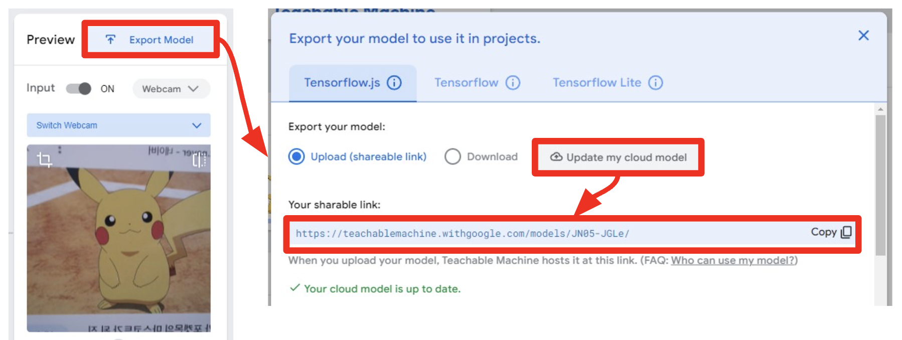
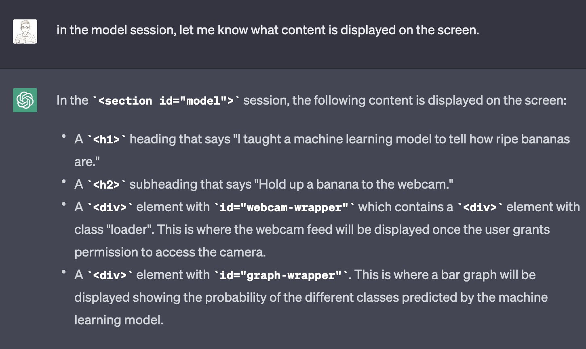

<!-- 
_class: lead
-->
# A.I. & Future Society
Practice using cases of A.I. and SW technology,
Think about the impact that digital technology will have on society in the future. 

YunJae Jang(janggoons@syu.ac.kr) 
Software Convergence Education Institute
Sahmyook University

---
## Index
* Create a fruit classification model - **machine learning** practice
* Create a fruit classification web app - **web app** production practice
* Improving the fruit classification web app - **generative AI** practice
* Discuss
   - What does it mean to use a computer/A.I./program?
   - What should I teach?

---

## Create a fruit classification model
* How do humans distinguish fruits?
   - The human eye can see the fruit.
   - Remember the shape of the fruit and the shape of the fruit you saw before,
   - Classify fruits by comparing color, shape, aroma, and taste of fruits in memory.
   - Neurons in the human brain do something to remember and compare.

---

## Create a fruit classification model
* How does a computer classify fruits?
   - You can view the fruit with a camera connected to the computer.
   - The shape of the fruit is stored as a number (binary number of 0 and 1),
   - Calculate the numbers well, find the representative values, and compare these values with the representative values of other fruit images.
   - The computer calculates a lot of numbers and compares the values.

---

## Create a fruit classification model

---
## Create a fruit classification model
* machine learning
   - The process by which machines learn new things, just like humans, is called machine learning.
   - Once you learn, you can remember the name of the fruit.
   - If you show me a new fruit, can you guess its name?

---
## Create a fruit classification model
* Let the computer learn fruits.
   - After preparing the fruit to learn,
   - Tell the computer the name of the fruit and make it remember it.
   - Show the same fruit with a slightly different appearance,
   - Guess the name of the fruit.

---

## [Teachable Machine](https://teachablemachine.withgoogle.com/)

---
## [Teachable Machine](https://teachablemachine.withgoogle.com/)
* Let the computer learn
   - Naming the class
   - Take (or upload) images by class
   - Click "Train Model"

--- 
## [Teachable Machine](https://teachablemachine.withgoogle.com/)
* Make sure you've learned well
   - Preview > Show each image and check if it is well classified
   - If the classification is not good, add image data and train again.

---
## Create a fruit classification web app
* web application, web app
   - Software that runs in a web browser
* Prepare
   - Export Model > Upload my model > (After uploading) Copy link for sharing

---

---
## Create a fruit classification web app
* Prepare
   - Go to Sample Web App > https://tm-image-demo.glitch.me/
   - Click "Remix this site on Glitch"

---
## Create a fruit classification web app
* Modify the code
   - Choose "index.html"
   - Change the URL address of the copied model
     - let URL = 'new url address';
   - Check out the finished web app
     - "PREVIEW"

---
## Improving the fruit classification web app
* Improving the code using chatGPT
   - chatGPT https://chat.openai.com/
   - chatGPT is a conversational artificial intelligence service using a pre-learned model
   - Think of chatGPT as a programmer and ask for code improvements.
   - The goal is to modify the description to fit our fruit classification model.

---

## Improving the fruit classification web app
* Tell chatGPT which code to modify
  - "we are going to edit the html code."
  - "the html code to be modified is as follows."
* Find what is shown on the screen
  - "tell me what to show on screen in this html code."
  - "in the model session, let me know what content is displayed on the screen."
* Modify what is displayed on the screen
  - "Modify the phrases "Fruit classification web app" and "Show the fruit on the webcam" to be displayed on the screen. And show only the modified code from the previous code."

---

---

---

---

---

---
## Improving the fruit classification web app
* chatGPT gives a plausible answer. (Hallucination)
* Don't trust the answer as it is, be sure to check it.

---
## Supervised Learning
* supervised learning,
   - It is a way to tell the correct answer and learn.
* Other learning methods include,
   - Unsupervised learning is a way to learn without telling the correct answer
   - Reinforcement Learning is a way to teach only the rules and learn in a winning direction.

---
## Supervised Learning
* What is the difference between human learning and computer learning?
   - **Human** can learn from a small number of experiences and examples. Human can discover new information through various failures in the process of imagining wildly unfamiliar fields or establishing and verifying hypotheses.
   - **Computer** need much more training data than humans. Computer can build models that classify more accurately if there is a lot of data provided. They classify faster and sometimes more accurately than humans.

---
## Discuss
* Using computers, artificial intelligence, and programs means
   - How will the social world in which I live change?
   - What will happen? What can you do?
   - Do computers benefit us? does it make you uncomfortable?
* What should I teach in the future?
   - Should I teach programming languages and how to code?
   - What to do and what not to do?

---
<!--
_class: lead
_paginate: false
-->
# Thanks! 🎉 
