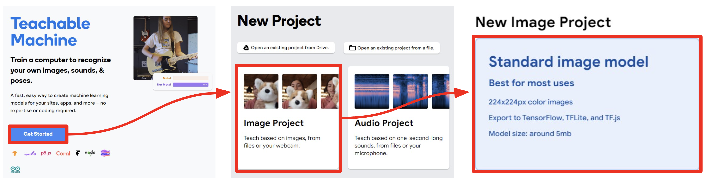

<!-- 
_class: lead
-->
# 컴퓨팅 사고와 인공지능 종합 프로젝트

장윤재(janggoons@syu.ac.kr)
SW융합교육원, 삼육대학교

---
## 학습목표
* 인공지능과 컴퓨팅 사고는 어떤 관계가 있는지 설명할 수 있다.
* 인공지능 기술을 이용하여 분류 모델을 학습시킬 수 있다.
* 인공지능 기술을 활용한 웹 서비스를 제작할 수 있다.

## 학습 내용
* 인공지능과 컴퓨팅 사고의 관계 탐구
* 과일 분류 모델 학습
* 과일 분류 웹 서비스 제작 및 개선

---
<!--
_class: lead
_paginate: false
-->
# 인공지능과 컴퓨팅 사고의 관계 탐구
1. 지능, 인공지능, 컴퓨팅 사고의 개념을 이해할 수 있다.
2. 인공지능과 컴퓨팅 사고의 관계에 대해 설명할 수 있다.

---
## 지능 intelligence
* 지능이란, 지식을 다룰 수 있는 능력

* 지능을 구현하는 요인
  - 언어 language : 지식을 표현하는 방법
  - 학습 learning : 다른 사람이 표현한 지식을 내 것으로 만드는 방법
  - 추론 reasoning : 학습한 지식을 바탕으로 새로운 지식을 만드는 방법

---
## 인공지능 artificial intelligence
* 인공지능이란, 
  - 인간의 지능을 컴퓨팅 시스템으로 구현한 것
  - 기계를 인간 행동의 지식에서와 같이 행동하게 만드는 것
  - 인간처럼 사고하고, 행동하는 시스템

* 인공지능을 구현하는 요인
  - 언어 : 지식을 컴퓨터가 기억 및 처리하도록 다루는 방법
  - 학습 : 사람의 사고 방식을 기계에게 가르치는 방법
  - 추론 : 학습한 모델로 새로운 지식을 만드는 방법

---
## 컴퓨팅 사고 computational thinking
컴퓨터가 효과적으로 수행할 수 있는 방식으로 문제를 해석하고,
문제해결 방법을 찾아내는 사고 과정 (Wing, 2017)

문제를 내가 아닌 다른 대상(컴퓨터)이 해결하도록 시키는데 필요한 사고
&rarr; 범위를 한정하고, 과정을 정확하게 제시해야 한다.
&rarr; 다른 대상(컴퓨터)이 할 수 있는 능력 내에서 제시해야 한다.

---
## 인공지능과 컴퓨팅 사고의 관계
* 다음 과정은 어떤 차이가 있는가?
  - 컴퓨팅 도구를 이용하여 문제를 해결하는 과정 &rarr; 컴퓨팅 사고!
  - 컴퓨터로 인공지능을 구현하기 위해 사용되는 문제해결 과정 &rarr; 컴퓨팅 사고!
  - 인공지능 기술을 이용하여 문제를 해결하는 과정 &rarr; 컴퓨팅 사고?

---
## 인공지능과 컴퓨팅 사고의 관계
* 컴퓨팅 도구를 이용하여 문제를 해결하는 것
  - 컴퓨팅 도구를 이용한다는 것은 프로그램을 만드는 것
  - 컴퓨터가 문제를 해결하도록 세부적인 과정을 정의하여 순서대로 동작하도록 하는 명령어들의 집합
  - 문제 해결을 위해 핵심 요소를 찾고, 순서를 정의하여 컴퓨터가 수행할 수 있도록 자동화 하는 것 &rarr; 컴퓨팅 사고!

---
## 인공지능과 컴퓨팅 사고의 관계
* 인공지능 기술을 이용하여 문제를 해결하는 것
  - 사람이 문제 해결을 위한 데이터를 컴퓨터에게 제공하면, 컴퓨터가 수 많은 데이터 간의 패턴을 발견하여 문제해결 과정을 만드는 것
  - 문제 해결을 위한 핵심 요소를 찾고, 순서를 정의하여 자동화하는 것은 사람이 하는가 컴퓨터가 하는가?
  - 인공지능 기술을 이용하는 사람은 무엇을 하는가? &rarr; 컴퓨팅 사고?

---
## 프롬프트 엔지니어링과 컴퓨팅 사고
* chatGPT 와 같은 생성형 인공지능 챗봇은, 사람의 질문(프롬프트)에 적절한 대답을 생성한다.
* 인공지능 챗봇이 정확한 대답을 생성하도록 적절하게 질문하는 방법을 프롬프트 엔지니어링 이라고 한다.
* 사람의 질문을 인공지능 챗봇이 잘 이해할 수 있는(문제를 해결할 수 있는) 형태로 만드는 데 필요한 능력은 컴퓨팅 사고일까?
* 적절한 질문(프롬프트)을 자동으로 만들어 내는 또 다른 인공지능을 만드는데 필요한 능력이 컴퓨팅 사고일까?

---
<!--
_class: lead
_paginate: false
-->
# 과일 분류 모델 학습
1. 과일 분류 학습을 위한 데이터를 수집할 수 있다.
2. 지도학습을 통해 모델을 학습시킬 수 있다.

---

## 사람은 과일을 어떻게 구분할까?
- 사람의 눈으로 과일을 볼 수 있다.
- 과일의 모습과 이전에 본 과일의 모습을 기억하여,
- 기억 속의 과일의 색, 모양, 향, 맛 등을 비교하여 과일을 구분한다.
- 사람 뇌의 뉴런들이 어떤 일을 하여 기억하고, 비교한다.

---

## 컴퓨터는 과일을 어떻게 구분할까?
- 컴퓨터에 연결된 카메라로 과일을 볼 수 있다.
- 과일의 모습은 숫자(0과 1로 된 이진수)로 저장되고, 
- 숫자들을 잘 계산하여, 대표되는 값을 찾고, 이 값 들과 다른 과일 이미지의 대표값과 비교한다.
- 컴퓨터가 수 많은 숫자들을 계산하고, 값을 비교한다.

---

## 컴퓨터가 사물을 인식하는 한 가지 방법 (CNN)

---

## 합성곱 신경망 (CNN)
* Convolutional Neural Network
  - 주로 이미지, 영상 데이터를 처리할 때 사용하는 딥러닝 모델
  - 인식할 데이터의 전체가 아닌 부분, 주변과의 관계를 집중하여 연산 과정을 효율적으로 처리하는 방법
  - 1989년 얀 르쿤, “Backpropagation applied to handwritten zip code recognition" 에서 처음 소개

---
## 과일 분류 모델 학습
* 머신러닝 machine learning
  - 기계가 사람 처럼, 새로운 것을 배우는 과정을 머신러닝 이라고 한다.
  - 한 번 학습하면 과일의 이름을 기억할 수 있다.
  - 새로운 과일을 보여준다면, 이름을 알 수 있을까?

---
## 과일 분류 모델 학습
* 컴퓨터에게 과일을 학습시키자.
  - 학습할 과일을 준비한 뒤, 
  - 컴퓨터에게 과일의 이름을 알려주고 기억하게 한다.
  - 조금 다른 모습의 같은 과일을 보여주고,
  - 과일의 이름을 맞추도록 한다.

---

## [Teachable Machine](https://teachablemachine.withgoogle.com/)

---
## [Teachable Machine](https://teachablemachine.withgoogle.com/)
* 컴퓨터 학습시키기
  - 구분(class)할 이름 지정
  - 구분(class)별로 이미지 촬영(또는 업로드)
  - 모델 학습(Train Model) 클릭

--- 
## [Teachable Machine](https://teachablemachine.withgoogle.com/)
* 잘 학습했는지 확인하기
  - Preview > 각각의 이미지를 보여주고 잘 분류하는지 확인
  - 분류가 잘 안되면 이미지 데이터를 추가하고, 다시 학습시킨다.

---
<!--
_class: lead
_paginate: false
-->
# 과일 분류 웹 서비스 제작 및 개선
1. 과일 분류 모델을 이용하여 웹 서비스를 제작할 수 있다. 
2. 제작한 웹 서비스를 개선할 수 있다.

---
## 과일 분류 웹 서비스 만들기
* 준비하기
  - Export Model > Upload my model > (업로드 완료 후) 공유용 링크 복사

---

---
## 과일 분류 웹 서비스 만들기
* 준비하기
  - 샘플 웹 서비스 이동 > https://tm-image-demo.glitch.me/
  - Remix this site on Glitch 클릭하기

---
## 과일 분류 웹 서비스 만들기
* 코드 수정하기
  - index.html 선택하기
  - 복사한 모델의 URL 주소를 변경하기
    - let URL = '새로운 url 주소';
  - 완성된 웹 앱 확인하기
    - PREVIEW

---
## 과일 분류 웹 서비스 개선하기
* chatGPT 를 이용하여 코드 개선하기
  - chatGPT https://chat.openai.com/
  - chatGPT 는 미리 학습된 모델을 이용하는 대화형 인공지능 서비스
  - chatGPT 를 프로그래머라고 생각하고, 코드 개선을 요청하자.
  - 목표는, 우리가 만든 과일 분류 모델에 맞도록 설명을 수정하는 것이다.

---

## 과일 분류 웹 서비스 개선하기
* chatGPT 에게 수정할 코드를 알려주기
  - "we are going to edit the html code."
  - "the html code to be modified is as follows."
* 화면에 보여지는 내용을 찾기
  - "tell me what to show on screen in this html code."
  - "in the model session, let me know what content is displayed on the screen."
* 화면에 보여지는 내용 수정하기
  - "Modify the phrases "Fruit classification web app" and "Show the fruit on the webcam" to be displayed on the screen. And show only the modified code from the previous code."

---

---

---

---

---

---
## 과일 분류 웹 서비스 개선하기
* chatGPT 는 그럴듯한 답변을 해준다. (Hallucination)
* 답변을 그대로 믿지 말고 꼭, 확인해야 한다.

---
## 지도학습 Supervised Learning
* 지도 학습은, 
  - 정답을 알려주고 학습하는 방법 입니다.
* 다른 학습 방법은,
  - 비지도 학습 Unsupervised Learning, 정답을 알려주지 않고 학습 하는 방법
  - 강화 학습 Reinforcement Learning, 규칙만 알려주고 이기는 방향으로 학습하는 방법은 

---
## 지도학습 Supervised Learning
* 사람의 학습과 컴퓨터 학습의 차이는 무엇일까?
  - 사람은 적은 수의 경험과 사례로도 학습이 가능
  - 사람은 잘 알지 못하는 분야에 대해서 엉뚱하게 상상하거나, 가설을 세우고 검증하는 과정에서 다양한 실패를 통해 새로운 정보 발견이 가능

---
## 지도학습 Supervised Learning
* 사람의 학습과 컴퓨터 학습의 차이는 무엇일까?
  - 컴퓨터는 사람보다 훨씬 많은 학습 데이터가 필요
  - 컴퓨터는 제공되는 데이터가 아주 많다면, 보다 정확하게 분류하는 모델을 만들 수 있음
  - 사람보다 빠르고 때로는 더 정확하게 분류 가능

---
## 논의하기
* 인공지능 기술을 사용한다는 것이, 
  - 나와 내가 살고 있는 사회를 어떻게 변화시킬까?
  - 어떤 일이 없어질까? 어떤 일을 새롭게 할 수 있을까?  
* 앞으로 무엇을 어떻게 가르쳐야 할까?
  - 프로그래밍 언어와 코드 작성하는 방법을 가르쳐야 할까?
  - 누구나 컴퓨팅 사고를 키워야 할까?

----

## 논의하기
* 인공지능 기술을 사용한다는 것이, 
  - 나와 내가 살고 있는 사회를 어떻게 변화시킬까?
  -> 지적 능력을 갖춘, 값싸고, 열심히 일하는 동료가 생겨났다. 
  -> 따라서, 개인의 생산성이 비약적으로 증가
  -> 반면, 비용을 지불할 수 없다면, 개인의 생산성은 극도로 감소
  - 어떤 일이 없어질까? 어떤 일을 새롭게 할 수 있을까?
  -> 증기기관이 등장하여 없어진 육체적인 노동자
  -> 컴퓨터가 등장하여 없어진 단순 계산원
  -> 인공지능이 등장하면, 문제해결 과정이 정의되고 이에 따라 반복적으로 수행하는 사람들
  -> 반면, 새로운 영역, 프롬프트 엔지니어링, 인공지능 활용 예술가, 사회 변화를 안정시킬 직업들, 상담심리, 법 규정...

---

## 논의하기
* 앞으로 무엇을 어떻게 가르쳐야 할까?
  - 프로그래밍 언어와 코드 작성하는 방법을 가르쳐야 할까?
  -> 그동안 컴퓨팅 사고를 키울 수 있는 가장 좋은 방법으로 프로그래밍 교육을 주장하였다.
  -> 인공지능에게 명령하는 프롬프트 과정을 가르쳐야 할까?
  - 누구나 컴퓨팅 사고를 키워야 할까?
  -> 조금만 지나면, 자연어로 프로그램을 작성하는 시기가 올 것이다.
  -> 지식을 표현하는 도구인 언어를 잘 활용하는 능력(리터러시)이 필요하다. 
  -> 그리고 여전히 컴퓨팅 사고는 필요하다. 인공지능 기술이 만든 결과물을 누군가는 확인해야 한다.
  -> 인간은 인공지능이 만든 결과물을 확인하고, 검증하는 능력이 필요하다.

---
## 학습퀴즈
인공지능 기술을 이용하여 문제를 해결하는 것에 대한 설명으로 가장 적절한 것은?
1. 프로그래밍 언어로 프로그램을 만드는 것
2. 컴퓨터가 문제를 해결하도록 세부적인 과정을 정의하여 순서대로 동작하도록 하는 프로그램을 작성하는 것
3. 사람이 문제 해결을 위해 핵심 요소를 찾고, 순서를 정의하여 컴퓨터가 수행할 수 있도록 자동화 하는 것
4. 사람이 문제 해결을 위한 데이터를 컴퓨터에게 제공하고, 컴퓨터가 수 많은 데이터 간의 패턴을 발견하여 문제해결 과정을 만드는 것

(정답 4)

---
## 학습퀴즈
사물을 분류하는 인공지능 모델을 학습시키기 위해 데이터와 분류 이름을 함께 제공하여 학습시키는 기계학습 방법은?
1. 지도학습
2. 비지도학습
3. 강화학습
4. 양자학습

(정답 1)

---
## 요약하기
* 인공지능과 컴퓨팅 사고의 관계
  - 문제해결 과정을 누가 만드는가?
* 과일 분류 모델 학습
  - 이미지 분류 모델 학습, 지도학습, 합성곱 신경망
* 과일 분류 웹 서비스 제작 및 개선
  - 웹 서비스 제작, 인공지능과 협업하여 코드 개선 

---
<!--
_class: lead
_paginate: false
-->
# Thanks! 🎉 

---
## 수업 사례
* 고등학교 인공지능과 미래사회 진로 특강 (2022.11)
  - 고등학생 72명 대상, 1시간 특강
  - 강의 자료 [링크](https://docs.google.com/presentation/d/1tjMlSs5bN2ZMWcTQe7QgLEe2v1KmtGyhHLMUs7sJKB4/edit?usp=sharing) | 특강 결과 [링크](https://sites.google.com/view/janggoons/lecture/speciallecture/2022-11-07)

* 고등학교 인공지능과 미래사회 진로 특강 (2022.11)
  - 고등학생 11명 대상, 3시간 특강
  - 강의 자료 [링크](https://docs.google.com/document/d/1y4sSah81LBZ-3z1xoo9g0yQm12Rt5V-pmRAtrewBD8k/edit?usp=sharing) | 특강 결과 [링크](https://sites.google.com/view/janggoons/lecture/speciallecture/2022-11-05)

---
## 수업 회고
* 기존에 경험하지 못했던 인공지능 기술의 결과와 사용의 용이성에 대해 학생들이 새롭고, 신기하고, 즐거운 경험을 함
* 특히, 내가 원하는 분류 모델을 직접 학습시키고 단순한 과정(템플릿 활용)으로 웹 서비스를 구축하는 과정을 통해 학생들이 집중하게 됨
* 인공지능 기초 강의로 적합하나 이를 응용한 새로운 웹 서비스를 제작을 위해서는 웹 서비스 제작 지식(html, css, javascript 등)이 요구됨
* 인공지능 기술을 간단하고 쉽게 활용할 수 있는 다양한 서비스를 이용하여 체험식의 교육이 가능하나, 기계학습, 딥러닝의 핵심 알고리즘을 이해하기에는 추가적인 학습과 시간이 필요함
